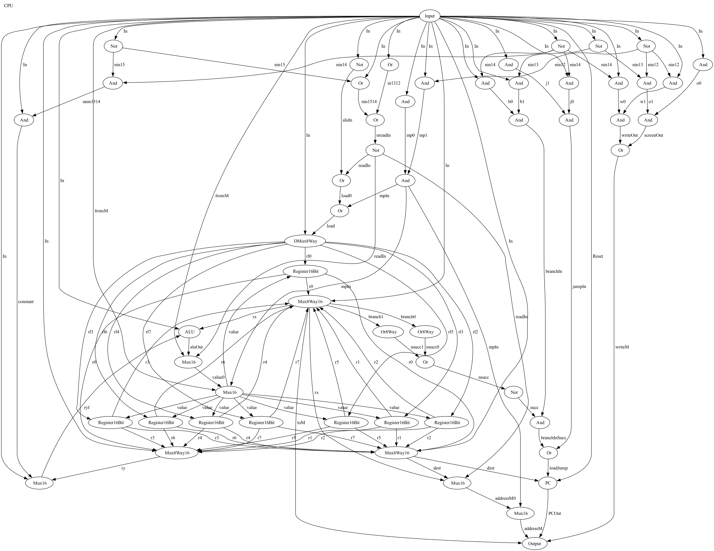

# Custom 16-bit CPU

This project involves creating a custom CPU using a 16-bit instruction set. The CPU is designed using Hardware Description Language (HDL).

## Overview

The goal of this project is to design and implement a custom 16-bit CPU. The CPU is capable of executing a set of instructions defined by our custom instruction set.

## Tools Required

To run and test the HDL code, you will need the following tools, which can be found [here](https://www.nand2tetris.org/software):

- Hardware Simulator
- CPU Emulator
- Assembler

## Output

Below is an image of the CPU output:

